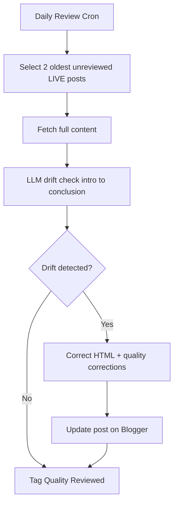
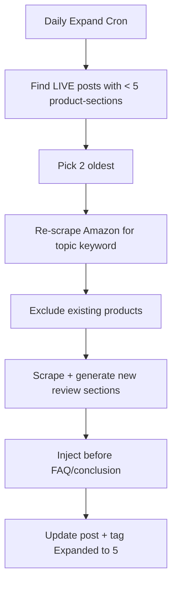
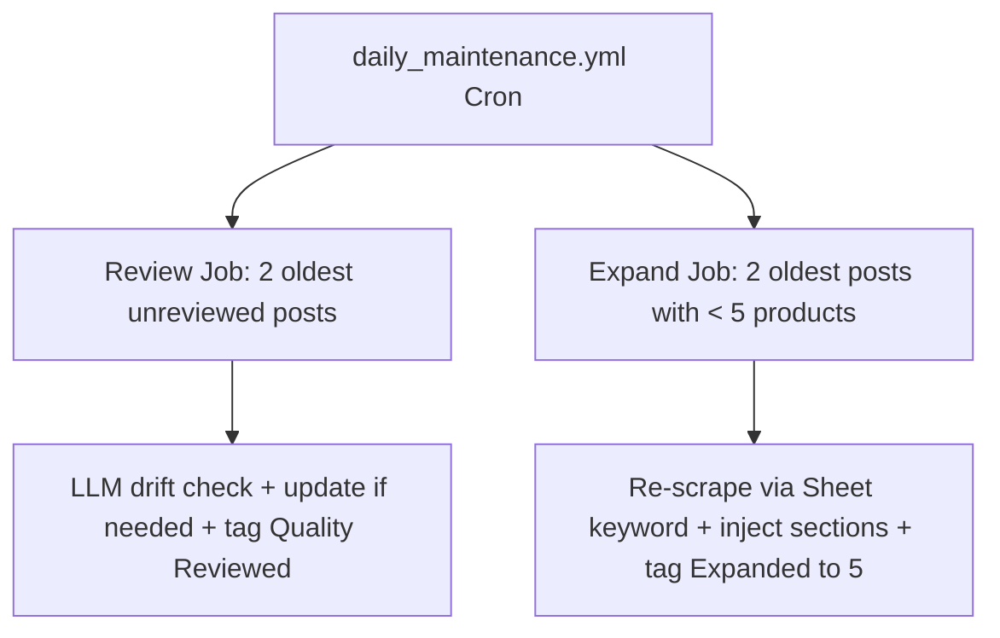

# Design: Daily Content Review + 5-Product Standard

## Goal
Two new capabilities for the RemoteProstor pipeline:

1. **Daily Published-Post Review** — Read 2 already-published Blogger posts per day (starting from topic 1 / oldest), review the full content (intro → conclusion) for context leakage / topic deviation, and update + republish if drift is found.
2. **5-Product Standard** — New posts must cover 5 Amazon products (currently sliced to 3). A separate workflow updates old posts that have fewer than 5 products, 2 posts/day, from 3 → 5.

---

## Part A — Daily Content Review (2 posts/day)

### Current State
- `scripts/daily_published_review.py` already reviews **1** post/day using `generator._apply_quality_corrections()` (regex-based EEAT/US/OSHA cleanup). It selects the oldest unreviewed LIVE post and tags it `Quality Reviewed`.
- `audit_posts.py` does a heavier LLM audit (mismatch / generic claims / forced links / hardcoded prices) but is a manual batch tool, not scheduled, and not limited to 2/day.

### Design
Extend the daily review into a **2-post, LLM-driven drift detector** while keeping the existing regex corrections as a safety net.

**New module: `core/content_reviewer.py`**
- `select_posts_for_review(publisher, count=2)` — reuse `list_all_posts()`, filter LIVE + not already reviewed (label `Quality Reviewed`), sort by published date ascending (topic 1 first), return first `count`.
- `review_post(post)`:
  1. Fetch full content via `publisher.get_post(post_id)`.
  2. Extract topic from title + labels (reuse logic from `daily_published_review.py:82`).
  3. Call Deepseek with a new `REVIEW_DRIFT_PROMPT` (added to `templates/prompts.py`) that returns JSON:
     ```json
     {
       "drift_detected": true/false,
       "drift_sections": ["intro", "conclusion"],
       "drift_summary": "mentions office chairs in a mouse article",
       "corrected_html": "<full corrected HTML if drift>"
     }
     ```
  4. If `drift_detected`, run `generator._apply_quality_corrections(corrected_html, topic, keyword)` as a final guard.
  5. If changed, `publisher.update_post()` and append `Quality Reviewed` label.
  6. Log to a new `Review Logs` sheet tab (reuse `sheets_manager.log_execution` pattern) for traceability.
- Keep `--apply` dry-run flag (reuse pattern from `daily_published_review.py:114`).

**Prompt:** Add `REVIEW_DRIFT_PROMPT` to `templates/prompts.py` instructing the model to check intro→conclusion for off-topic leakage, cross-category mentions (e.g., chairs in a mouse post), and hallucinated products, then return corrected full HTML.

**Workflow:** New `.github/workflows/daily_review.yml` — cron daily (offset from publisher, e.g. `0 18 * * *`), runs `python scripts/daily_published_review.py --apply` (updated to process 2 posts). Reuse existing `review_published` job pattern from `daily_publisher.yml:59`.

**Mermaid:**


---

## Part B — 5-Product Standard

### Current State
- `core/scraper.py:68` already caps at **5** products (`if len(product_urls) >= 5: break`).
- `main.py:94` and `scripts/run_batch.py:68` both slice `product_urls[:3]` → only 3 used.
- No record of how many products a published post contains → needed to find "old posts with < 5".

### Design

**1. Default new posts to 5 products**
- Change `main.py:94` and `scripts/run_batch.py:68` from `product_urls[:3]` → `product_urls[:5]`.
- `generate_full_post()` already loops over all `products` passed in, so no content-generator change needed.
- Add a `Product Count` column to the main Sheet; `sheets_manager.update_row_status` writes `len(products_data)` (already passed as `product_count` to `log_execution`).

**2. Backfill old posts (2/day, 3 → 5)**
- **Detect count:** Parse existing published post HTML — count `.product-section` blocks (the wrapper used in `content_generator.py:277`). Posts with < 5 `.product-section` are candidates.
- **New module: `core/post_product_expander.py`**
  - `find_posts_under_5(publisher)` — list LIVE posts, count `.product-section`, return those with < 5, sorted oldest first.
  - `expand_post(post)`:
    1. Determine topic/keyword from title + labels.
    2. Re-scrape Amazon for the keyword → get up to 5 product URLs (`scraper.search_products`).
    3. Exclude products already present (match by ASIN/URL) to avoid duplicates.
    4. Scrape details for the missing ones (up to 5 total).
    5. Generate review sections for the new products via `generator.generate_section(REVIEW_TEMPLATE, ...)`.
    6. Inject new `<section class="product-section">` blocks before the FAQ/conclusion/footer.
    7. Re-run `_apply_quality_corrections`.
    8. `publisher.update_post()`; tag with `Expanded to 5`.
- **New script: `scripts/expand_old_posts.py`** — processes 2 posts/day (arg `--apply`), reusing the select/apply pattern.
- **New workflow: `.github/workflows/daily_expand.yml`** — cron daily, runs the expander for 2 posts.

**Mermaid:**


---

## Files to Change / Create

| File | Change |
| :--- | :--- |
| `core/scraper.py` | Already returns 5; no change (verify cap stays 5). |
| `main.py` | `product_urls[:3]` → `product_urls[:5]`; write `Product Count`. |
| `scripts/run_batch.py` | `product_urls[:3]` → `product_urls[:5]`. |
| `core/content_reviewer.py` | **New** — 2-post drift review. |
| `core/post_product_expander.py` | **New** — backfill to 5 products. |
| `scripts/daily_published_review.py` | Update to process 2 posts via `content_reviewer`. |
| `scripts/expand_old_posts.py` | **New** — 2 posts/day expander entrypoint. |
| `templates/prompts.py` | Add `REVIEW_DRIFT_PROMPT`. |
| `core/sheets_manager.py` | Support `Product Count` column + `Review Logs` tab. |
| `.github/workflows/daily_review.yml` | **New** — review cron. |
| `.github/workflows/daily_expand.yml` | **New** — expand cron. |
| `docs/10_Changelog.md` | Log changes (per Architecture Freeze, this is implementation, not scope change). |

## Confirmed Decisions
- **Workflow:** One combined workflow (review + expand) — add as jobs to `daily_publisher.yml` (or a single new `daily_maintenance.yml`).
- **Old-post expansion source:** Reuse the original keyword stored in the Google Sheet (no live re-scrape of a fresh search beyond what the stored keyword implies; use `scraper.search_products(keyword)` with the Sheet keyword).
- **Date handling:** Keep original publish date when expanding (preserve SEO history); only `content` + `labels` are updated.

## Final Workflow Layout (separate file)
- New file: `.github/workflows/daily_maintenance.yml` (separate from `daily_publisher.yml` since user already runs other Actions events).
- Two jobs: `review` (2 posts) and `expand` (2 posts), each triggered by `schedule` cron + `workflow_dispatch`.
- Timing (UTC cron, offset from publisher at 12:00 UTC):
  - `review`: `30 12 * * *` (12:30 UTC / 18:00 IST)
  - `expand`: `0 13 * * *` (13:00 UTC / 18:30 IST)
- Both jobs inject the same secrets as `daily_publisher.yml` and run the respective scripts with `--apply`.


